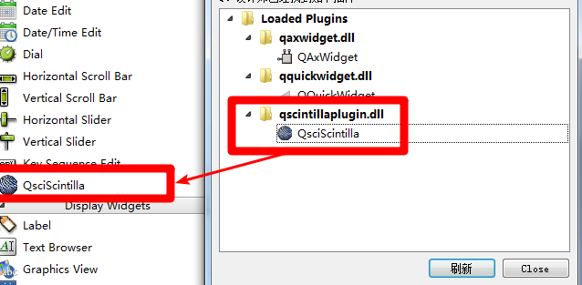

环境说明：

- QT 5.11.1

- MinGW32 5.3.0

安装说明：

- 将本目录下的 qscintilla2_qt5.dll 复制到 Qt5.11.1\5.11.1\mingw53_32\bin\

- 将本目录下的 qscintillaplugin.dll 复制到 Qt\Qt5.11.1\5.11.1\mingw53_32\plugins\designer\

解释：
qscintillaplugin.dll依赖于qscintilla2_qt5.dll，但是make install的时候只把qscintillaplugin.dll拷贝了，
没有拷贝qscintilla2_qt5.dll

见下图（不能识别dll）

还有下图（成功识别）

